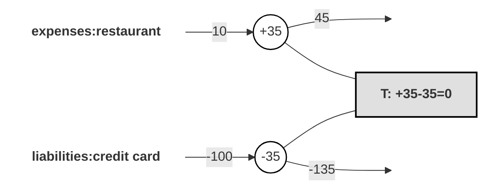

# Learn Double-Entry Accounting Principles

This is a concise introduction to double-entry accounting - just enough to get
you productive with `hledger-build`. If you're already familiar with these
concepts, feel free to skip ahead.

## The Core Idea

Double-entry accounting is a method of counting where every movement of money
is recorded in at least two places. When you spend $50 on groceries, two things
happen simultaneously: your bank account decreases by $50, and your grocery
expenses increase by $50. Both sides of the exchange are recorded.

Each of these records is called a **posting**, and a group of postings that
represent a single event is called a **transaction**. The fundamental rule is
simple:

> **The sum of all postings in a transaction must equal zero.**

That's it. This single constraint is what makes the entire system work. If $50
leaves your checking account (−$50), it must arrive somewhere else (+$50).
Nothing appears from thin air, and nothing disappears.

## Accounts

An **account** is a named bucket that accumulates a running total — its
**balance**. You create accounts to mirror the real-world places your money
lives and the categories it flows through.

Accounts are organized into a hierarchy using colons as separators, like
`Assets:Bank:Checking` or `Expenses:Food:Groceries`. You can create as many as
you need.

## The Five Account Types

Every account belongs to one of five types. Understanding these is the key to
reading any financial report.

**Assets** — Things you **have**. Bank accounts, cash, investments, property.
Balances are normally positive.

**Liabilities** — Things you **owe**. Credit cards, loans, mortgages. Balances
are normally negative (from your perspective, these represent money owed to
someone else).

**Income**[^1] — Value you **receive** in exchange for something (usually your time
or investments). Salary, dividends, interest. Balances are normally negative —
this may feel counterintuitive, but it reflects that income "flows toward you"
from somewhere.

**Expenses** — Value you **consume** or spend. Food, rent, taxes, entertainment.
Balances are normally positive.

**Equity** — A special type used to summarize the net effect of all past income
and expenses. You rarely interact with equity accounts directly; they exist to
make the books balance across time periods.

The first two (Assets and Liabilities) describe your financial position **at a
point in time** — "how much do I have right now?" The next two (Income and
Expenses) describe what **changed over a period** — "where did my money go this
quarter?"

Here's a quick reference for the normal sign and purpose of each type:

| Type        | Normal sign | Measures                    |
| ----------- | ----------- | --------------------------- |
| Assets      | positive    | Position at a point in time |
| Liabilities | negative    | Position at a point in time |
| Expenses    | positive    | Change over a period        |
| Income      | negative    | Change over a period        |
| Equity      | negative    | Summary / net worth         |

The sign convention follows a single principle: all accounts are kept from
**your** perspective. Liabilities are negative because you owe that money to
someone else. Income is negative because it represents value you gave away
(your time, your capital) in exchange for money flowing in.

## A Transaction in Practice

Here's what a typical transaction looks like conceptually. You buy lunch for
$35 on your credit card:

```ledger
2024-03-15 "Eataly" "Lunch with Maria"
    expenses:food:restaurants      35.00 USD
    liabilities:credit card:visa  -35.00 USD
```

The expense account goes up by $35 (you consumed something), and your credit
card balance goes down by $35 (you owe more). The sum is zero:



A paycheck is more involved but follows the same principle:

```ledger
2024-03-01 "Employer" "March salary"
    Assets:Bank:Checking         4000.00 USD
    Expenses:Taxes:Federal        800.00 USD
    Expenses:Taxes:State          200.00 USD
    Income:Salary               -5000.00 USD
```

Your gross salary of $5,000 (negative, because it's income) gets split into
what you take home and what goes to taxes. The sum is still zero.

## Key Reports

From this data, two essential reports can be generated:

**Balance Sheet** — A snapshot of your financial position at a specific moment.
It lists all your Assets, Liabilities, and Equity accounts with their current
balances. This answers: "What is my net worth right now?"

**Income Statement** — A summary of all Income and Expenses over a period of
time (a month, quarter, or year). This answers: "Where did my money come from
and where did it go?" The difference between income and expenses is your **net
income** — whether you saved money or spent more than you earned.

## The Accounting Equation

The zero-sum rule for individual transactions has a powerful global
consequence. Because every posting belongs to a transaction that sums to zero,
the sum of **all** postings across your entire ledger must also equal zero. If we
let each letter represent the total balance of that account type:

> `A + L + X + I + E = 0`

where **A** = Assets, **L** = Liabilities, **X** = Expenses, **I** = Income,
**E** = Equity.

**Net income** is the combined balance of your income and expense accounts over
a period:

> `NI = X + I`

Because Income is normally negative and Expenses positive, a positive NI means
you spent more than you earned, and a negative NI means you came out ahead
(saved money).

When you generate a Balance Sheet, the software "clears" the income statement
accounts — it moves the accumulated NI into Equity, giving an updated equity
value `E' = E + NI`. Substituting back:

> `A + L + E' = 0`

Rearranged (and flipping signs to match the traditional textbook form):

> `Assets = Liabilities + Equity`

This is the **fundamental accounting equation**. It states that everything you
own (Assets) is financed either by debt (Liabilities) or by your own net worth
(Equity). A Balance Sheet is simply a snapshot that verifies this equation
holds at a particular date.

## The Chart of Accounts

The full list of accounts you use is called your **chart of accounts**. There's
no single correct way to organize it — you tailor it to your own life.
[Account Names](https://hledger.org/account-names.html) can be capitalized
and include spaces. Do whatever you like!

```
Assets:US:Vanguard:401k
assets:us:bank of america:checking
liabilities:us:chase:credit_card
Expenses:Housing:Rent
Income:US:Employer:Salary
```

Start simple. You can always add more accounts later as you want finer-grained
tracking.

## Why Bother?

The double-entry constraint means your books are always internally consistent.
If a number is wrong somewhere, the imbalance will surface — the system is
self-auditing. Over time, your ledger becomes a complete, queryable history of
your financial life. You can answer questions like: What's my net worth? How
much did I spend on travel last year? What are my tax obligations? Where should
I invest next?

## Further Reading

This primer covers just the essentials. For a deeper and more thorough
treatment, the Beancount documentation is excellent:

- [The Double-Entry Counting Method](https://beancount.github.io/docs/the_double_entry_counting_method.html).
  A comprehensive walkthrough of double-entry bookkeeping from first principles, including trial balances, equity, and the accounting equation.
- [Command-Line Accounting in Context](https://beancount.github.io/docs/command_line_accounting_in_context.html).
  Motivation and context for why plain-text accounting is worth doing, and how the pieces fit together.

[^1]:
    In traditional double-entry accounting, this account type is usually
    called **Revenue**. The word "income" there refers to **net income** — the
    difference between revenue and expenses (i.e., profit). Plain-text accounting
    tools like hledger often use **Income** as the account type name instead since
    it is more intuitive for personal finance.
